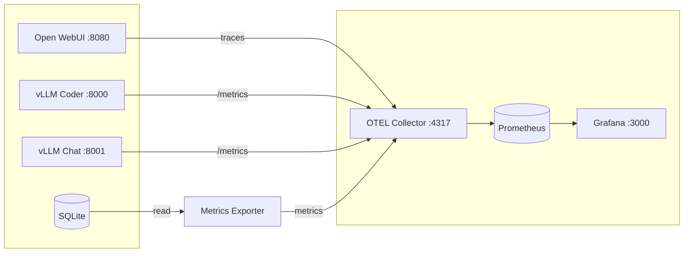
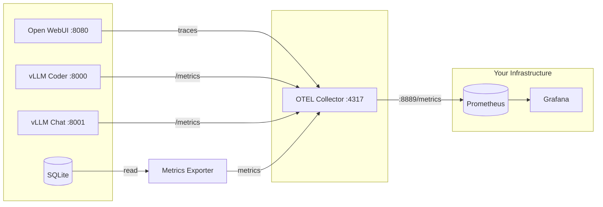

# Open WebUI Monitoring

Grafana dashboards for Open WebUI + vLLM.

## Architecture



## Files

| File | Description |
|------|-------------|
| `supervision-airgap.yml` | Full monitoring stack (Grafana, Prometheus, OTEL, metrics exporter) |
| `supervision-external.yml` | Lightweight stack for external Prometheus (OTEL + metrics exporter only) |
| `openwebui-vllm.yml` | Example application stack (for testing only) |
| `airgap-download.sh` | Script to build airgap bundle (full stack) |
| `airgap-download-external.sh` | Script to build airgap bundle (external Prometheus) |

> **Note:** `openwebui-vllm.yml` is provided as a reference example. Use your own Open WebUI and vLLM deployment configuration.

## Configuration (before deployment)

Adapt these files before running the airgap script or deploying:

### 1. `.env` - Credentials and settings

```bash
GF_ADMIN_USER=admin              # Grafana username
GF_ADMIN_PASSWORD=changeme       # Grafana password
EXPORT_INTERVAL=15               # Metrics export interval (seconds)
```

### 2. `otel-config/otelcol-config.yaml` - vLLM endpoints

Update with your vLLM container names and ports:

```yaml
static_configs:
  - targets:
    - vllm-coder:8000      # Change to your vLLM container:port
    - vllm-chat:8001       # Add/remove as many vllm container you run
```

### 3. `supervision-airgap.yml` - Network

If deploying with Open WebUI on the same host, ensure all containers share the same network:

```yaml
networks:
  monitoring:
    external: true         # Uses existing network from Open WebUI and vllm
```

## Airgapped Deployment

For networks without internet access.

### On machine with internet

```bash
chmod +x airgap-download.sh
./airgap-download.sh
```

This creates `airgap-bundle/` containing:
- `otel-lgtm.tar` - Grafana OTEL stack image
- `metrics-exporter.tar` - Pre-built exporter image
- `supervision-airgap.yml` - Docker compose file
- `.env` - Configuration file (edit before deploying)
- Config files (grafana/, otel-config/)

### On airgapped machine

```bash
# Copy airgap-bundle/ to target machine, then:
cd airgap-bundle

# Load images
docker load -i otel-lgtm.tar
docker load -i metrics-exporter.tar

# Edit .env with your settings
docker-compose -f supervision-airgap.yml up -d
```

Access:
- Grafana: http://localhost:3000 (credentials in .env)
- Executive Dashboard: http://localhost:3000/d/openwebui-executive
- vLLM Operations: http://localhost:3000/d/openwebui-vllm-ops

## External Prometheus Deployment

Lightweight variant for environments with an existing Prometheus and Grafana.
Only runs the OTEL Collector and metrics exporter — no local Prometheus or Grafana.

### Architecture (external variant)



### Configuration (external variant)

#### 1. `.env` - External Prometheus settings

```bash
cp .env.external.example .env
# Edit .env:
PROMETHEUS_URL=http://your-prometheus:9090
EXPORT_INTERVAL=15
```

#### 2. `otel-config/otelcol-config-external.yaml` - vLLM endpoints

Update with your vLLM container names and ports (same as full stack variant).

#### 3. Prometheus scrape config

Add this job to your Prometheus configuration:

```yaml
- job_name: openwebui
  scrape_interval: 15s
  static_configs:
    - targets: ['<docker-host>:8889']
```

#### 4. Run

```bash
docker compose -f supervision-external.yml up -d
```

Verify: `curl http://localhost:8889/metrics` should return Prometheus-format metrics.

### Airgapped Deployment (external variant)

```bash
# On machine with internet:
chmod +x airgap-download-external.sh
./airgap-download-external.sh

# On airgapped machine:
cd airgap-bundle-external
docker load -i otel-collector-contrib.tar
docker load -i metrics-exporter.tar
# Edit .env with your settings (PROMETHEUS_URL, EXPORT_INTERVAL)
docker compose -f supervision-external.yml up -d
```

### Dashboard Import

The dashboard JSON files are in `grafana/dashboards/`. Import them manually into your Grafana:

1. Go to **Dashboards > Import**
2. Upload `openwebui-executive.json`
3. Upload `openwebui-vllm-ops.json`
4. Select your Prometheus datasource during import

> **Note:** If panels show "No data" after import, verify the datasource UID matches. The dashboards use UID `prometheus` by default — Grafana will prompt you to select the correct datasource during import.

## Generate KPI Report

Generate a formatted KPI report for management:

```bash
# By date range
docker exec metrics-exporter python kpi_report.py 2026-01-01 2026-01-31

# By month
docker exec metrics-exporter python kpi_report.py --month 2026-01

# Export to file
docker exec metrics-exporter python kpi_report.py --month 2026-01 > kpi-2026-01.txt
```

Output:
```
============================================================
KPI REPORT: 2026-01-01 to 2026-01-19
============================================================

KEY METRICS:
  Active Users:                        42
  Total Tokens Generated:       1,250,000
  Avg Response Time:               0.345s

TOKENS BY MODEL:
  Qwen/Qwen2.5-Coder-1.5B-Instruct-AWQ     750,000 ( 60.0%)
  Qwen/Qwen2.5-0.5B-Instruct               500,000 ( 40.0%)

============================================================
```

## Dashboards

Two pre-configured Grafana dashboards are included.

### Executive KPI Dashboard

High-level metrics for management: active users, token usage, model distribution, and user leaderboard.


### vLLM Operations Dashboard

Technical monitoring for vLLM performance: request latency, token throughput, KV cache usage, and queue depth.


## Notes

- vLLM exposes metrics at `/metrics` by default
- Both stacks share the `openwebui-data` volume
- Connect containers to same network for OTEL to work

## Metrics

See [METRICS.md](METRICS.md) for available metrics and queries possible on vllm /metrics and openwebui.

## License

MIT
